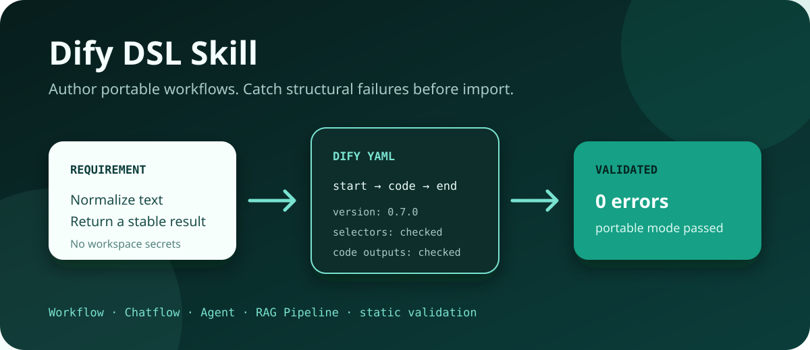

# Dify DSL Skill

[](https://github.com/LeeHoo29/dify-dsl-skill/actions/workflows/ci.yml)
[](LICENSE)
[](https://github.com/langgenius/dify/releases/tag/1.17.1)
[](https://github.com/langgenius/dify/blob/main/api/constants/dsl_version.py)

[English](README.md)



通过自然语言生成可用、可维护、自动排版的 [Dify](https://github.com/langgenius/dify) Workflow 或 Chatflow DSL。

项目把 Agent 设计能力与确定性工具结合起来，使生成的工作流可以在导入前完成源码同步、自动布局和静态校验，正常情况下不再需要进入 Dify 手工拖动节点。

> 非官方社区项目，与 LangGenius 无隶属或背书关系。

## 包含的能力

- `dify-dsl`：负责工作流设计、YAML、变量绑定、Code 契约集成、ELK 自动布局和导入前校验。
- `dify-python-code-node`：负责所有新增或实质修改的 Python Code 节点源码和测试。
- `dify-local-sync`：安全配置用户控制的本地 Dify，导入/覆盖 Draft，可选发布并严格验证。
- 静态校验器：检查图结构、选择器、Code 契约、Loop/Iteration、编辑器敏感字段、版本和可移植安全信息。
- Code 源码同步：确保独立 `.py` 文件与 DSL 的 `data.code` 一致。
- ELK 自动布局：排布整张图、分支、注释和容器子节点，并检查幂等性与重叠。

## 支持范围

| 产物 | v0.2 状态 |
|---|---|
| Workflow (`workflow`) | 主要支持 |
| Chatflow (`advanced-chat`) | 主要支持 |
| App DSL `0.7.0` | 主要支持，使用 Dify 1.17.1 官方 fixtures 审计 |
| App DSL `0.6.0` | 兼容模式，显式传入 `--target-version 0.6.0` |
| Agent / Chatbot / Text Generator | 实验性指导和结构校验 |
| RAG Pipeline | 实验性生成，官方模板已进入校验器兼容审计 |
| 本地 self-hosted Docker 导入/发布 | 通过显式授权的 `dify-local-sync` 支持 |
| Dify Cloud 或远程发布 | 不在范围内；Draft 导入/导出请使用官方 `difyctl` |

## 安装

为 Codex 和 Claude Code 同时安装三个 Skill：

```bash
npx skills add LeeHoo29/dify-dsl-skill \
  --skill dify-dsl \
  --skill dify-python-code-node \
  --skill dify-local-sync \
  -g -a codex -a claude-code -y
```

要使用完整校验和自动布局工具链，克隆一次并安装固定依赖：

```bash
git clone https://github.com/LeeHoo29/dify-dsl-skill.git
cd dify-dsl-skill
python3 -m pip install -r requirements.txt
npm ci --prefix skills/dify-dsl
```

环境要求：Python 3.10+、Node.js 20+、npm。

### 使用自然语言安装

也可以直接让 Agent 安装，不需要手动输入 Shell 命令：

```text
请从 https://github.com/LeeHoo29/dify-dsl-skill 为当前 Agent 安装三个 Skill：
dify-dsl、dify-python-code-node、dify-local-sync。
请使用仓库文档中的 `npx skills add` 命令。
本次只安装 Skill，不修改我的 Dify 配置，不导入 DSL，也不发布 Workflow。
```

如果只需要生成和校验 DSL，可以不安装 `dify-local-sync`：

```text
请从 https://github.com/LeeHoo29/dify-dsl-skill 为当前 Agent 安装
`dify-dsl` 和 `dify-python-code-node`，并确认两个 Skill 可以被发现。
本次只安装 Skill。
```

安装只会修改 Agent 本地的 Skill 目录，不会配置 `INNER_API_KEY`、修改 Docker、导入 DSL 或发布 Dify 应用。

## 让 Agent 生成

```text
使用 $dify-dsl 按以下需求生成 Dify 0.7.0 Workflow。
所有新增 Python Code 节点使用 $dify-python-code-node。
可复用 Python 放入 docs/dify-code-nodes，完成源码同步、自动布局、
portable 检查和 DSL 校验后再交付。
```

完整流程：

```text
自然语言需求
  -> 图结构和节点契约
  -> 独立 Python Code 源码
  -> Code 嵌入同步
  -> ELK 自动布局
  -> 静态与安全校验
  -> 导入候选 DSL
  -> 可选的本地 Draft 导入和显式发布
```

## 校验与排版

```bash
python3 skills/dify-dsl/scripts/sync_code_nodes.py dev-dsl/app.yml \
  --source-root docs/dify-code-nodes --write
python3 skills/dify-dsl/scripts/sync_code_nodes.py dev-dsl/app.yml \
  --source-root docs/dify-code-nodes

node skills/dify-dsl/scripts/layout_dify_dsl.mjs dev-dsl/app.yml --write
node skills/dify-dsl/scripts/layout_dify_dsl.mjs dev-dsl/app.yml --check

python3 skills/dify-dsl/scripts/validate_dify_dsl.py dev-dsl/app.yml \
  --target-version 0.7.0 --portable
```

只有需要跨 Workspace 分发或公开分享的文件才使用 `--portable`。普通校验允许保留目标 Workspace 的 Credential 和 Dataset 绑定。

## 快速接入本地 self-hosted Dify

`dify-local-sync` 仅用于用户控制的本地 Dify Docker Compose，目前以 Dify 1.17.1 为已验证基线。它不通过远程 URL 暴露 Inner API，也不会打印生成的 Key。

用户可以直接用自然语言让 Agent 驱动完整流程：

```text
使用 $dify-dsl 按我的需求生成工作流，完成源码同步、自动布局和校验。
然后使用 $dify-local-sync 接入 /path/to/dify 的本地 Dify。
修改 Inner API 配置、同步 Draft、发布 Workflow 前分别向我确认。
```

只检查、不修改：

```bash
python3 skills/dify-local-sync/scripts/setup.py --dify-root /path/to/dify
```

明确授权本地配置后：

```bash
python3 skills/dify-local-sync/scripts/setup.py --dify-root /path/to/dify --apply
```

预览创建/覆盖计划：

```bash
python3 skills/dify-local-sync/scripts/sync.py dev-dsl/app.yml \
  --project-root /path/to/dsl-project \
  --dify-root /path/to/dify --via-container \
  --account-email user@example.com
```

明确授权 Draft 同步和发布后：

```bash
python3 skills/dify-local-sync/scripts/sync.py dev-dsl/app.yml \
  --project-root /path/to/dsl-project \
  --dify-root /path/to/dify --via-container \
  --account-email user@example.com \
  --apply --publish

python3 skills/dify-local-sync/scripts/verify.py dev-dsl/app.yml \
  --project-root /path/to/dsl-project \
  --dify-root /path/to/dify --via-container \
  --strict-sha --require-published
```

setup 只把 Key 写入 Dify 已忽略的 Compose env 文件，并生成用于向 API 注入配置的本地 Compose override。创建与 Draft 导出使用容器内部的 Inner API；覆盖、版本确认和发布使用 API 容器内的 Dify Service Layer，因为 Dify 1.17.1 的 Inner API 未提供这些操作。配置、Draft 创建/覆盖和发布是三个独立授权边界。

本地同步脚本以 Dify `1.17.1` 为已验证基线。其他 Dify 版本可能改变内部 Service Layer 或 Inner API 请求结构。请先执行 setup 检查和 sync dry-run，确认目标版本与 Compose 结构后，再使用 `--apply`。

## Code 源码规则

对于 `dev-dsl/*.yml`：

- 唯一源码位于 `docs/dify-code-nodes/**/*.py`；
- Code 节点 `data.desc` 包含 `Code source: docs/dify-code-nodes/<path>.py`；
- `sync_code_nodes.py --write` 将源码嵌入 DSL；
- 缺少来源、路径越界、源码缺失、契约不一致或代码漂移都会校验失败。

## 验证证据

公开示例包含最小 Workflow、最小 Chatflow，以及一个由独立 Python 源码同步生成的 Managed-Code Workflow。

- 单元测试覆盖 DSL 校验、portable 安全检查、Code 源码同步、自动布局、本地 env 配置、Profile 应用和发布映射。
- CI 直接审计 Dify `1.17.1` 官方 Workflow fixtures 与 RAG transform 模板，不复制模板到本仓库。
- 公开示例通过严格 portable 校验和布局幂等检查。

导入前检查不代表运行完成。本地同步只有在 Draft 验证，以及用户要求发布时的 Published 指针/版本验证均通过后才算完成。模型、Dataset、插件和 Credential 仍取决于目标 Dify 环境。

## 安全边界

公开仓库不包含真实凭据、Dataset ID、Workspace ID、签名 URL 或私有接口。本地同步拒绝被 Git 跟踪的 Compose env 文件，并保持 Key 只在本地容器链路使用。提交导出的 DSL 前请阅读 [SECURITY.md](SECURITY.md)。

## 开发验证

```bash
python3 -m unittest discover -s tests -v
npm audit --prefix skills/dify-dsl
node skills/dify-dsl/scripts/layout_dify_dsl.mjs skills/dify-dsl/examples/*.yml --check
```

项目采用 MIT License。Dify 名称和商标归其权利人所有。
