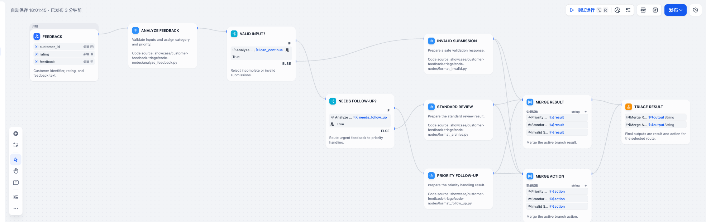

# 客户反馈分流 Workflow

这是一个无需模型提供商、可以直接导入的 Dify Workflow。它会校验客户反馈、确定优先级、分流紧急情况，并将三条路径汇合为稳定输出。



截图来自本地 Dify 1.15.0 的真实导入和发布结果，并已脱敏；自动兼容审计基线仍是 Dify 1.17.1 / App DSL 0.7.0。

## 自然语言需求

```text
创建一个 Dify Workflow，接收客户 ID、1-5 星评分和反馈正文。
校验输入并清理反馈文本，识别低评分，或者 refund、damaged、missing、late 等运营风险词。
将风险反馈分流为优先跟进，其余反馈进入标准归档；无效输入返回可操作的修改建议。
最终只返回一份稳定结果和推荐动作，不依赖模型提供商、插件、Dataset 或外部 API。
```

## 展示能力

- 无 Workspace 绑定的 portable Workflow DSL；
- YAML 外独立维护的 Python Code 源码；
- 输入校验和优先级两级判断；
- 三条分支通过 Variable Aggregator 汇合；
- ELK 自动排版和静态校验；
- 单一且稳定的 End 节点契约。

## 验证

```bash
python3 skills/dify-dsl/scripts/sync_code_nodes.py \
  showcase/customer-feedback-triage/workflow.yml \
  --source-root showcase/customer-feedback-triage/code-nodes

node skills/dify-dsl/scripts/layout_dify_dsl.mjs \
  showcase/customer-feedback-triage/workflow.yml --check

python3 skills/dify-dsl/scripts/validate_dify_dsl.py \
  showcase/customer-feedback-triage/workflow.yml \
  --target-version 0.7.0 --portable
```
